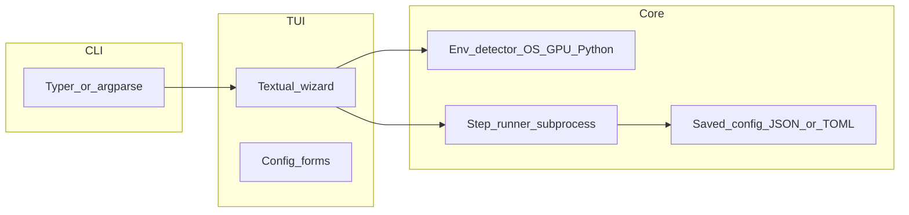

# แผนแอป TUI ช่วยตั้งค่า Ollama และ vLLM

## บริบทสำคัญก่อนลงมือ

- **Ollama**: ติดตั้งง่ายบน macOS/Linux (brew หรือสคริปต์จากเว็บ) — เหมาะกับ quick setup ที่โฟกัส “มี service + ดึงโมเดล”
- **vLLM**: ใช้งานจริงเกือบทั้งหมดบน **Linux + NVIDIA GPU (CUDA)** — บน **macOS ไม่มี CUDA แบบเดสก์ท็อป** จึงควรให้ TUI **ตรวจจับ OS/GPU** แล้วแนะนำทางเลือก เช่น Docker บน Linux, รัน remote, หรือข้าม vLLM บน Mac
- แอปนี้ควรเน้น **orchestration + validation** (รันคำสั่ง, อ่านผล, แสดงขั้นตอน) มากกว่า embed logic ซับซ้อนของ vLLM ทั้งหมดในโค้ด

## เป้าหมายผลิตภัณฑ์ (สั้น ๆ)

| โหมด | Ollama (ตัวอย่างขอบเขต) | vLLM (ตัวอย่างขอบเขต) |
|------|-------------------------|------------------------|
| **Quick** | ตรวจว่ามี `ollama` หรือยัง → ถ้าไม่มีช่วยติดตั้ง → `serve` (หรือบอกให้เปิดแอป) → เลือกโมเดลแล้ว `pull` | ตรวจ Python/CUDA → สร้าง venv → `pip install vllm` (หรือ Docker compose ถ้าเลือก) → คำสั่งรันอย่างง่าย |
| **Full** | ทุกอย่างใน Quick + เลือก port, ตัวแปร env (`OLLAMA_*`), โฟลเดอร์ models, systemd/launchd (ตาม OS), health check | + เลือก CUDA version, torch index, ขนาด context, tensor parallel, ทดสอบ `python -c` import, smoke test inference (ถ้ามีโมเดล) |

## สแต็กที่แนะนำ (ติดตั้งง่ายบนเทอร์มินัล)

**ทางเลือก A — Python + Textual + Typer** (แนะนำถ้าต้องการ iterate เร็วและติดตั้งผ่าน `pipx`)

- **TUI**: [Textual](https://textual.textualize.io/) (Python, layout ดี, maintain ง่าย)
- **CLI entry**: Typer หรือ argparse — คำสั่งเช่น `llm-setup tui` / `llm-setup quick`
- **แจกจ่าย**: `pipx install .` จาก repo หรือ publish บน PyPI; ผู้ใช้มี Python 3.10+ ก็พอ

**ทางเลือก B — Go + Bubble Tea / Huh** (ถ้าต้องการ binary เดียวไม่พึ่ง Python runtime)

- แจกจ่าย: `go install` หรือ release binary จาก GitHub Actions
- TUI: Bubble Tea + [charmbracelet/huh](https://github.com/charmbracelet/huh) สำหรับฟอร์ม

**ทางเลือก C — Rust + ratatui** — performance และ binary เดียว แต่เวลาพัฒนาอาจนานกว่า A

สำหรับโจทย์ “เล็ก ๆ + config หลายค่า” **A มักคุ้มที่สุด** เพราะ ecosystem สำหรับ subprocess และ packaging ชัด

## สถาปัตยกรรมหลัก

- **Env detector**: `platform`, อ่าน `nvidia-smi` (ถ้ามี), เวอร์ชัน Python, ว่ามี `docker` หรือไม่
- **Step runner**: รันคำสั่งทีละขั้น แสดง log ใน TUI (หรือ spinner) จับ exit code
- **Persist**: เก็บ profile ที่ user เลือก (เช่น `~/.config/yourapp/config.toml`) เพื่อรันซ้ำหรือ upgrade

## สิ่งที่ต้อง “ทำ” เป็นขั้นตอนงาน (checklist)

1. **นิยาม user story** — ผู้ใช้เปิดแอปแล้วเลือก: Ollama / vLLM / ทั้งคู่ → เลือก quick/full → ยืนยัน destructive actions (ติดตั้ง, pull ใหญ่)
2. **State machine ของ wizard** — หน้าจอ: welcome → เลือก stack → เลือกโหมด → ตรวจสภาพ → แสดงแผน (dry-run) → execute → สรุป + คำสั่ง copy-paste สำหรับรันประจำ
3. **Abstraction “installer backend”** — interface เช่น `check_installed()`, `install()`, `configure()` แยก implementation ต่อ OS (darwin vs linux) เพื่อไม่ให้ TUI ยุ่งกับ string คำสั่งโดยตรง
4. **Ollama module** — ตรวจ `which ollama`, brew install หรือ curl script (บอก user ก่อนรัน), `ollama pull`, optional `OLLAMA_HOST`, ทดสอบ `ollama list` / HTTP local
5. **vLLM module** — ถ้าไม่ใช่ Linux+NVIDIA ให้แสดงข้อความชัด + ทางเลือก Docker; ถ้าใช่ ให้ venv + pip + ตัวแปร `CUDA_HOME` ถ้าจำเป็น + คำสั่งรันขั้นต่ำ (`vllm serve ...`)
6. **Logging และ rollback แบบง่าย** — log ไฟล์ใน `~/.cache/...`; rollback = ลบ venv หรือบอกขั้นตอนย้อน (ไม่ต้องทำ transaction ซับซ้อนในขั้นแรก)
7. **การติดตั้งแอปเอง** — `pyproject.toml` + entry point `console_scripts`; เอกสาร README สั้น ๆ: `pipx install git+...` หรือ `uv tool install`
8. **ทดสอบ** — unit test สำหรับ detector (mock subprocess); smoke test บน CI แบบไม่รัน GPU

## โครงสร้างโฟลเดอร์ที่เสนอ (Python)

- `src/yourapp/__main__.py` / `cli.py` — entry Typer
- `src/yourapp/tui/` — หน้า Textual
- `src/yourapp/backends/ollama.py`, `vllm.py`
- `src/yourapp/detect.py` — รวมการตรวจสภาพ
- `pyproject.toml`, `README.md`

(ชื่อแพ็กเกจเปลี่ยนตามที่คุณตั้งการ branding)

## ความเสี่ยงและวิธีลด

- **สิทธิ์ sudo**: แยกขั้นตอนที่ต้อง sudo ออกมาชัด; แสดงคำสั่งให้ user รันเองถ้าไม่ต้องการ auto
- **เครือข่ายและขนาดโมเดล**: แสดงขนาดโมเดลก่อน pull; รองรับ cancel
- **เวอร์ชัน vLLM/CUDA**: เก็บ “matrix” แนะนำใน config ภายในแอป (อัปเดตเป็นรอบ ๆ) แทน hardcode กระจาย

## สรุป

คุณจะได้แอป CLI ที่มี **wizard TUI** แยก **quick/full**, แยก **backend ต่อเครื่องมือ** (Ollama / vLLM), มี **detection ก่อนลงมือ** และ **วิธีแจกจ่ายชัด** (แนะนำ Python + Textual + pipx สำหรับโปรเจกต์เล็ก). ขั้นต่อไปหลังอนุมัติแผนคือสร้าง repo โครง `pyproject.toml`, skeleton Typer + Textual, แล้ว implement Ollama path ก่อน (สั้นและ verify ง่าย) ตามด้วย vLLM path พร้อม guard บน macOS
