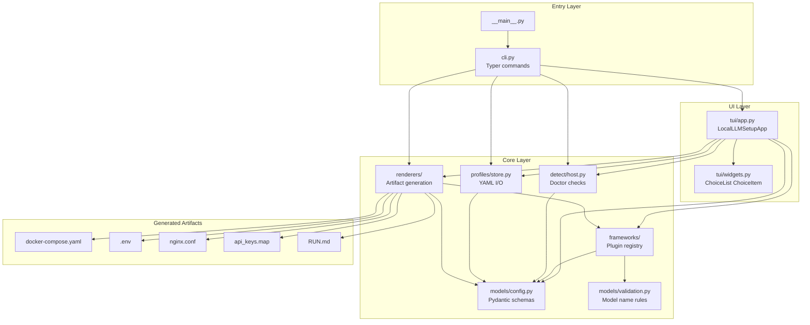
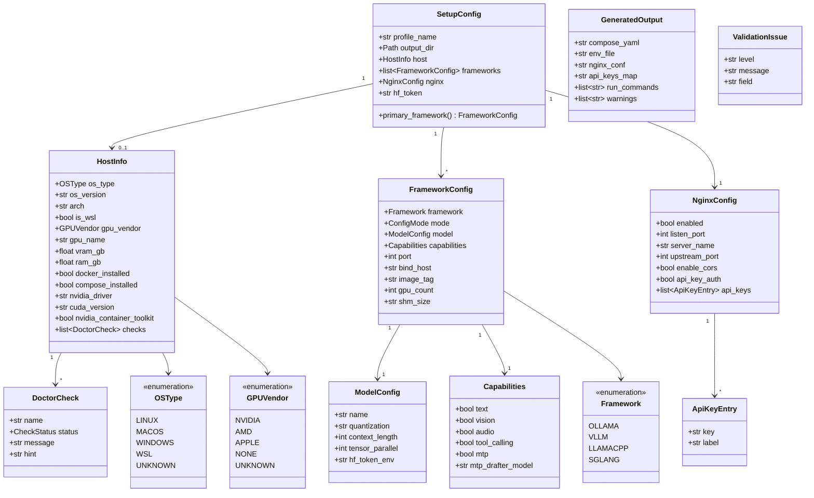
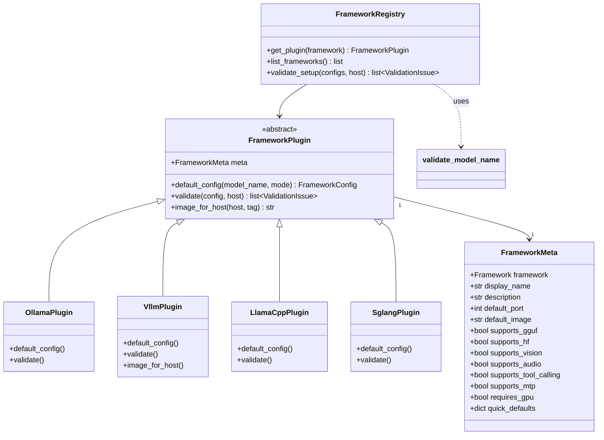
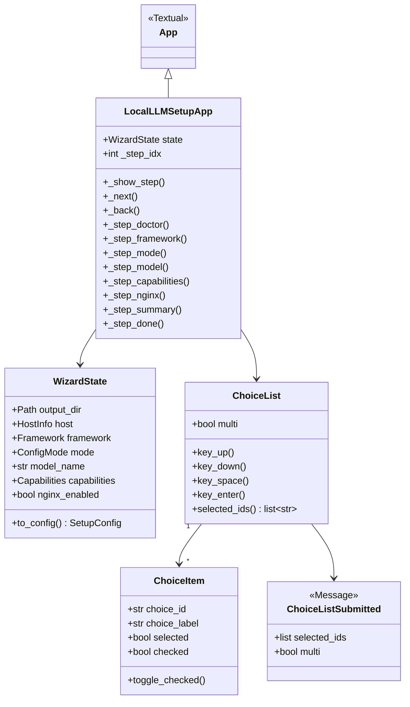
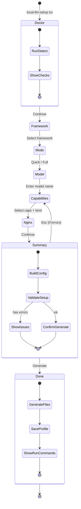
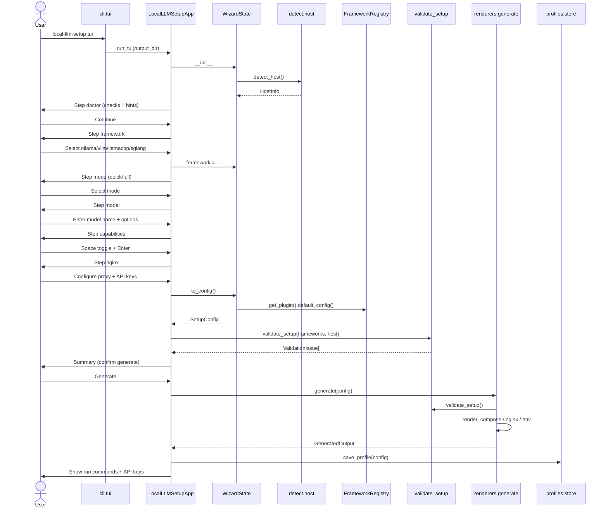
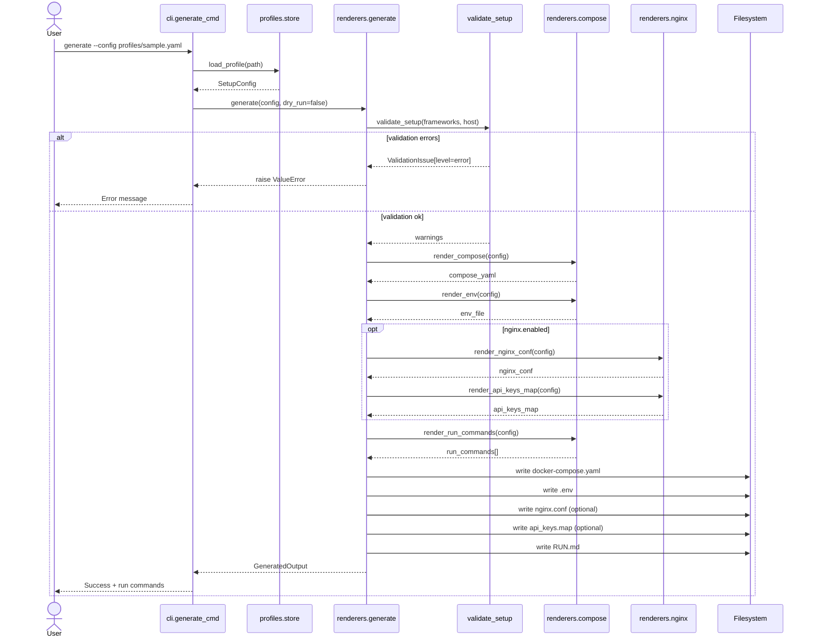
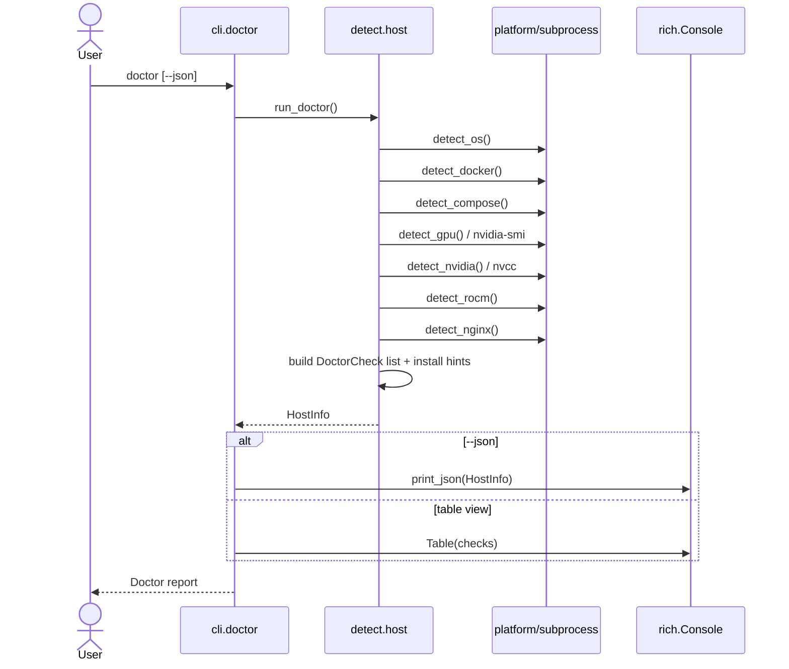
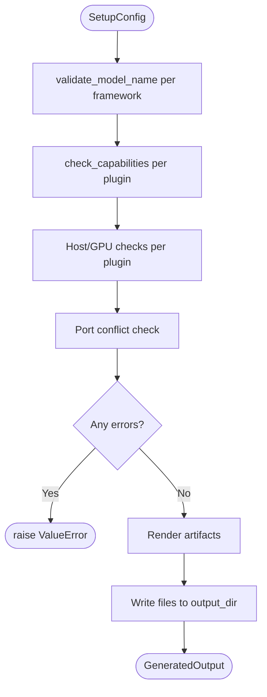
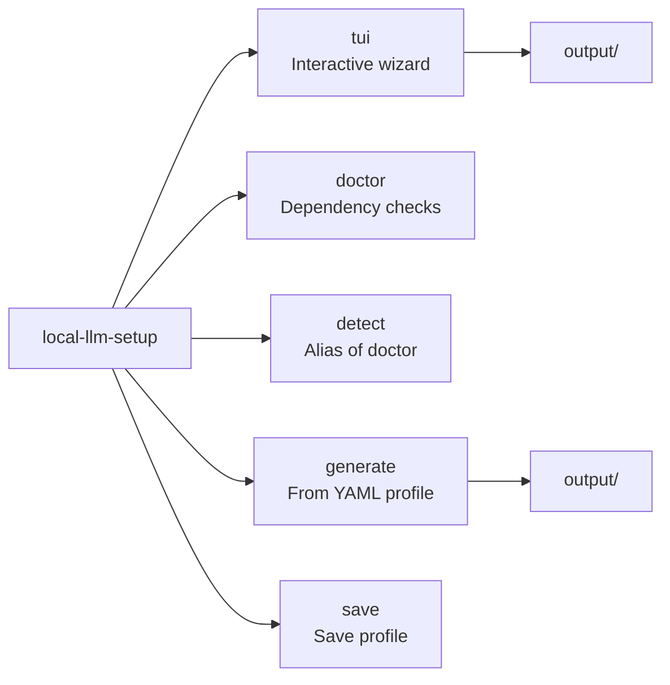

# UML — Local LLM Setup

เอกสารนี้อธิบายสถาปัตยกรรมของ `local-llm-setup` ด้วย UML diagrams (Mermaid) อ้างอิงจากโค้ดใน `src/local_llm_setup/`

---

## 1. Package / Component Diagram

แสดงโมดูลหลักและความสัมพันธ์ระหว่าง layer



---

## 2. Class Diagram — Domain Models

โมเดลกลางที่ใช้ร่วมกันระหว่าง CLI, TUI, renderers และ tests



---

## 3. Class Diagram — Framework Plugins

แต่ละ inference framework เป็น plugin ที่มี metadata, defaults และ validation ของตัวเอง



| Plugin | Model source | GGUF | GPU | MTP |
|--------|-------------|------|-----|-----|
| OllamaPlugin | Ollama registry | No | Optional | No |
| VllmPlugin | Hugging Face | No | Required | Yes |
| LlamaCppPlugin | GGUF path/URL | Yes | Optional | No |
| SglangPlugin | Hugging Face | No | Required | Yes |

---

## 4. Class Diagram — TUI



---

## 5. State Diagram — TUI Wizard Steps



ลำดับ step ตาม `STEPS` ใน `tui/app.py`:

```
doctor → framework → mode → model → capabilities → nginx → summary → done
```

---

## 6. Sequence Diagram — TUI Wizard (Happy Path)



---

## 7. Sequence Diagram — `generate` Command



---

## 8. Sequence Diagram — `doctor` Command



---

## 9. Deployment Diagram

```mermaid
flowchart LR
    subgraph host [Host Machine]
        subgraph cli_mode [CLI Mode]
            UserCLI[User]
            Venv[Python venv<br/>local-llm-setup]
            OutDir[./output/]
        end

        subgraph docker_mode [Dockerized Setup App]
            UserDocker[User]
            SetupContainer[local-llm-setup container]
            MountVol[/workspace/output]
        end

        subgraph runtime [Generated Runtime]
            DockerEngine[Docker Engine]
            LLMContainer[ollama / vllm / llamacpp / sglang]
            NginxContainer[nginx optional]
        end
    end

    UserCLI --> Venv
    Venv --> OutDir

    UserDocker --> SetupContainer
    SetupContainer --> MountVol

    OutDir --> DockerEngine
    MountVol --> DockerEngine
    DockerEngine --> LLMContainer
    DockerEngine --> NginxContainer
    NginxContainer -->|proxy| LLMContainer
```

---

## 10. Activity Diagram — Validation Pipeline



ระดับความรุนแรงของ `ValidationIssue`:

| level | ผลลัพธ์ |
|-------|---------|
| `error` | หยุด generate |
| `warn` | แสดงเตือน แต่ generate ต่อได้ |
| `info` | แจ้งข้อมูลเพิ่มเติม |

---

## 11. File Map

```
src/local_llm_setup/
├── cli.py                 # Typer: tui, doctor, detect, generate, save
├── __main__.py            # python -m local_llm_setup
├── detect/
│   └── host.py            # OS/GPU/Docker doctor
├── frameworks/
│   ├── base.py            # FrameworkPlugin ABC, FrameworkMeta
│   ├── ollama.py
│   ├── vllm.py
│   ├── llamacpp.py
│   ├── sglang.py
│   └── __init__.py        # Registry + validate_setup()
├── models/
│   ├── config.py          # Pydantic domain models
│   └── validation.py      # Model name format rules
├── profiles/
│   └── store.py           # YAML save/load
├── renderers/
│   ├── compose.py         # docker-compose.yaml, .env, RUN.md
│   ├── nginx.py           # nginx.conf, api_keys.map
│   └── __init__.py        # generate()
└── tui/
    ├── app.py             # LocalLLMSetupApp wizard
    └── widgets.py         # ChoiceList, ChoiceItem
```

---

## 12. CLI Commands Overview



---

## การอ่าน diagram

- เปิดไฟล์นี้ใน GitHub, GitLab หรือ VS Code (Markdown Preview) เพื่อ render Mermaid
- Class diagram แสดง **โครงสร้างข้อมูล** ไม่ใช่ทุก method ในโค้ด
- Sequence diagram แสดง **flow หลัก** ของ happy path; error handling ย่อไว้ใน validation pipeline
